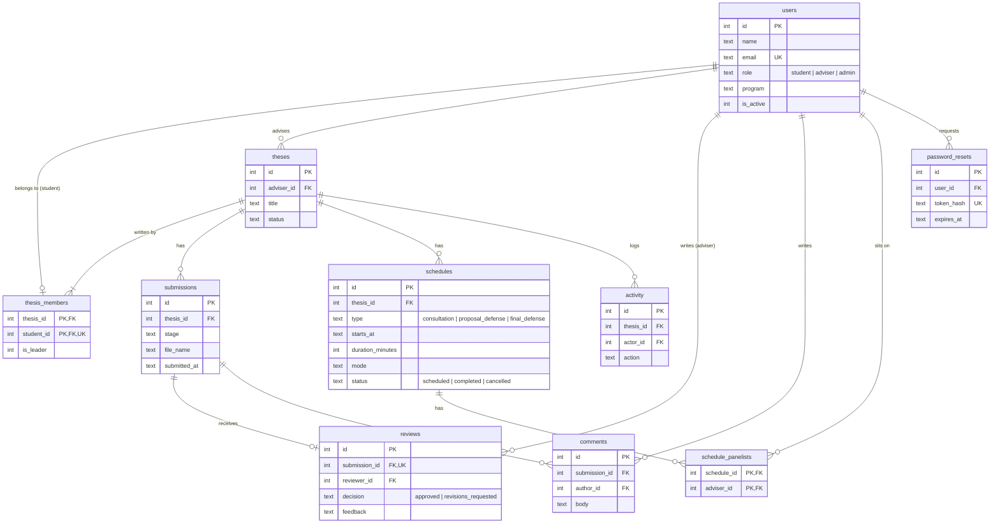

# ThesisTrack: Thesis Management System

A full stack web app for managing student theses from proposal to final defense. It has three roles, Student, Adviser, and Admin, and each role only sees and uses the features that belong to it.

**Stack:** React (Vite) · Express · SQLite relational database (Node's built-in `node:sqlite`) · JWT auth · file uploads with multer

## Getting started

Requires **Node.js 22.13 or newer** (`brew install node`).

```bash
npm install                            # install client + server dependencies
cp server/.env.example server/.env     # create your local env file
npm run db:seed                        # create the database with demo data
npm run dev                            # run the API and the website together
```

Open http://localhost:5173. The API runs at http://localhost:3001/api.

> If you pulled a change to the database schema, the server applies it on the next start and keeps your data. Watch for a line like `Database upgraded: applied 005_add_notifications.sql`.

### Demo accounts

The adviser and student accounts use the password **`password123`**. The admin account does not: set `SEED_ADMIN_PASSWORD` in `server/.env` before seeding, or leave it unset and copy the random password that `npm run db:seed` prints. The admin signs in as `admin@example.edu` unless you set `SEED_ADMIN_EMAIL`. In development, the login page has buttons that fill these accounts in.

| Role    | Email                  | What you'll see                                                        |
| ------- | ---------------------- | ---------------------------------------------------------------------- |
| Admin   | `admin@example.edu`    | System stats, all theses and events, user management                   |
| Adviser | `maria.santos@tms.edu` | One advisee, one submission to review, upcoming consultation and defense |
| Student | `ana.cruz@tms.edu`     | Two stages approved, Chapters 4–5 under review, final defense scheduled |

Run `npm run db:seed` any time to reset the database and uploaded files back to the demo data. It deletes everything else, so use it in development only.

## Roles and permissions

Every rule below is enforced by the API. The UI also hides what a role can't use, and each role's pages are only downloaded by that role.

| Feature                                   | Student                    | Adviser                          | Admin                        |
| ----------------------------------------- | -------------------------- | -------------------------------- | ---------------------------- |
| Dashboard                                 | Own progress and feedback  | Review queue and advisees        | System overview              |
| Create a thesis (one per student; creator leads the group) | ✅        | —                                | —                            |
| Add or remove group members (up to 5)     | Group leader; any member can leave | —                        | ✅                           |
| View theses                               | Own group's only           | Assigned advisees only           | All                          |
| Edit thesis title, abstract, keywords     | Own, until completed       | —                                | —                            |
| Upload submissions (PDF/DOC/DOCX, 50 MB)  | Own thesis                 | —                                | —                            |
| Download submission files                 | Own                        | Advisees                         | All                          |
| Review (approve / request revisions)      | —                          | Advisees                         | — (read-only)                |
| Comment on submissions                    | Own                        | Advisees                         | — (read-only)                |
| View schedule                             | Own events                 | Advisees' events + panels they sit on | All                     |
| Schedule consultations                    | —                          | Advisees                         | ✅                           |
| Schedule defenses and assign panelists    | —                          | —                                | ✅                           |
| Edit, complete, or cancel events          | —                          | Own advisees' consultations      | ✅                           |
| Delete events                             | —                          | —                                | ✅                           |
| Score a defense                           | —                          | Panels they sit on               | —                            |
| Record a defense verdict                  | —                          | —                                | ✅                           |
| See a defense result                      | Own, once the verdict is in | Advisees', and panels they sit on | All                         |
| Assign advisers, override status, delete theses | —                    | —                                | ✅                           |
| Search theses, people, and submissions    | Own group, adviser, and work | Advisees and their work        | All                          |
| Manage users                              | —                          | —                                | ✅                           |
| View the audit log of admin changes       | —                          | —                                | ✅                           |
| Export theses and adviser workload to CSV | —                          | —                                | ✅                           |

Users who try to open something outside their role get a 403 (wrong role) or 404 (a record they aren't allowed to see).

### Thesis workflow

A thesis belongs to a **group of 1 to 5 students**. The student who creates it is the group leader and adds classmates by the email on their student accounts. Every member can edit the thesis, submit, and comment. If the leader leaves, the longest-standing member takes over.

A thesis moves through four stages, in order: **Proposal → Chapters 1–3 → Chapters 4–5 → Final Manuscript**.

1. The student uploads a manuscript for a stage. The thesis becomes **Under review**. Only one submission can be pending at a time.
2. The assigned adviser adds a **review**: approve, or request revisions with written feedback.
3. After revisions are requested, the thesis shows **Needs revisions** and the student uploads a new version.
4. After an approval, the thesis is **In progress** and the student moves on to the next stage.
5. Once the Final Manuscript is approved, the thesis is **Completed**.

Along the way, advisers schedule **consultations** and admins schedule the **proposal defense** and **final defense** with a panel of advisers. The API rejects events that overlap for the same thesis, adviser, or panelist.

## Database

The app uses a relational SQLite database. Its shape is built by the numbered files in [`server/src/database/migrations/`](server/src/database/migrations/), starting from [`004_baseline.sql`](server/src/database/migrations/004_baseline.sql).



- **Foreign keys** are enforced (`PRAGMA foreign_keys = ON`). Deleting a thesis cascades to its submissions, reviews, comments, schedules, and activity.
- **`reviews`** has a unique `submission_id`, so a submission can only be reviewed once.
- **`schedule_panelists`** is a join table for the many-to-many link between defenses and advisers.
- **`thesis_members`** links students to their thesis group. `student_id` is unique, so a student belongs to at most one thesis, and a partial unique index allows only one leader per group. Deleting a student removes them from their group; if they were the last member, the thesis is deleted too.
- **`submission_details`** is a view that joins each submission with its review. A submission's status (`pending`, `approved`, `revisions_requested`) comes from its review, so status is never stored twice.
- **`password_resets`** holds one-time reset links. Only a SHA-256 hash of each token is stored. A link expires after 1 hour and is deleted once used. No email service is set up yet, so outside production the reset link is printed in the server console and shown on the "Forgot password" page.
- **Changing the schema:** add the next numbered file to `server/src/database/migrations/` (for example `005_add_notifications.sql`). On the next start the server applies every migration above the database's current `PRAGMA user_version`, each in its own transaction, so a failed migration leaves the database on its last good version. Existing accounts, theses, and uploads are kept.
- **Never edit a migration that has already run.** It has executed on real databases; correct it with a new file instead.
- **`npm run db:seed` is for demo data only.** It deletes the database and every upload, and refuses to run when `NODE_ENV=production` unless `SEED_ALLOW_PRODUCTION=yes` is set.

## Project structure

Folder names say what they hold. When something breaks, [TROUBLESHOOTING.md](TROUBLESHOOTING.md) maps each symptom to the files to check, in order.

```
Capstone/
├── client/                     # React website (Vite)
│   └── src/
│       ├── App.jsx             # routes, role guards, lazy-loaded pages
│       ├── shared-state/       # who is signed in (AuthContext), toast messages
│       ├── api-client/api.js   # every API call
│       ├── reusable-logic/     # loading/error state and background refresh
│       ├── ui-pieces/
│       │   ├── layout/         # sidebar (per-role navigation) and top bar
│       │   ├── auth/           # route guards
│       │   ├── schedule/       # event list and event form
│       │   ├── thesis/         # thesis form, upload form, admin controls
│       │   └── basics/         # badges, modals, stat cards, progress ring, error screen
│       ├── screens/
│       │   ├── auth/           # login, register, forgot and reset password
│       │   ├── student/        # student dashboard, my thesis
│       │   ├── adviser/        # adviser dashboard
│       │   ├── admin/          # admin dashboard, user management
│       │   └── *.jsx           # shared: theses, thesis detail, submission, schedule, profile
│       ├── helpers/            # date and text formatting, shared labels
│       └── styles/index.css    # design tokens, layout, animations
└── server/                     # Express API
    ├── data/                   # SQLite database file (git-ignored)
    ├── uploads/                # uploaded manuscripts (git-ignored)
    └── src/
        ├── database/           # connection, migrations/, seed.js
        ├── api-endpoints/      # URL → handler, with role checks
        ├── request-handlers/   # request handling and validation
        ├── database-queries/   # SQL, one file per table
        ├── permission-rules/   # who can see and change which records
        ├── request-filters/    # sign-in check, uploads, rate limits, headers, errors
        └── helpers/            # passwords, validation, files, file signatures
```

## API overview

| Method       | Endpoint                                   | Who                                  |
| ------------ | ------------------------------------------ | ------------------------------------ |
| POST         | `/api/auth/register`, `/api/auth/login`    | Public                               |
| POST         | `/api/auth/forgot-password`, `/api/auth/reset-password` | Public                  |
| GET / PATCH  | `/api/auth/me`                             | Signed in                            |
| GET          | `/api/dashboard`                           | Signed in (different data per role)  |
| GET          | `/api/theses`, `/api/theses/:id`           | Signed in (scoped by role)           |
| POST         | `/api/theses`                              | Student                              |
| PATCH        | `/api/theses/:id`                          | Student (own)                        |
| PATCH        | `/api/theses/:id/adviser`, `/api/theses/:id/status` | Admin                       |
| DELETE       | `/api/theses/:id`                          | Admin                                |
| POST         | `/api/theses/:id/submissions`              | Student (own)                        |
| POST / DELETE | `/api/theses/:id/members`, `/api/theses/:id/members/:studentId` | Group leader, Admin (members can remove themselves) |
| GET          | `/api/submissions/:id`, `/api/submissions/:id/file` | Anyone with thesis access   |
| POST         | `/api/submissions/:id/comments`            | Student (own), assigned adviser      |
| PATCH        | `/api/submissions/:id/review`              | Assigned adviser                     |
| GET          | `/api/search?q=`                           | Signed in (scoped by role)           |
| GET          | `/api/schedules?range=upcoming\|past`      | Signed in (scoped by role)           |
| POST / PATCH | `/api/schedules`, `/api/schedules/:id`     | Adviser (consultations), Admin       |
| DELETE       | `/api/schedules/:id`                       | Admin                                |
| *            | `/api/users`, `/api/users/advisers`        | Admin                                |

## Scripts

| Command           | What it does                                          |
| ----------------- | ----------------------------------------------------- |
| `npm run dev`     | Starts the API (auto-reload) and the Vite dev server  |
| `npm run build`   | Builds the website into `client/dist`                 |
| `npm start`       | Runs the API and serves `client/dist` if it exists    |
| `npm run db:seed` | Deletes the database and uploads, then loads demo data (development only) |
| `npm run db:backup` | Copies the database and uploads into `server/backups/`, then removes old ones |
| `npm run lint`    | Checks the code with ESLint                           |
| `npm test`        | Runs the API tests (each on a throwaway database) and client tests |

Every push and pull request to `main` or `development` runs lint, tests, and the build on GitHub Actions (`.github/workflows/ci.yml`).

## Production notes

**Deploying for real students? Follow [DEPLOYMENT.md](DEPLOYMENT.md)** — install, every setting, nginx with HTTPS, keeping the server running, nightly backups, and upgrading safely. The points below are the essentials.

- Set `NODE_ENV=production` and a long random `JWT_SECRET` in `server/.env`. The server refuses to start in production without one.
- Behind nginx or a hosting platform, set `TRUST_PROXY=1`. Without it every visitor shares one rate limit, so a few wrong password-reset attempts from anyone lock out everyone.
- Run `npm run build`, then `npm start`. Express serves the website and the API from one port.
- Every response carries security headers from `server/src/request-filters/securityHeaders.js`: a content security policy, `X-Content-Type-Options: nosniff`, frame denial, a referrer policy, and HSTS once `NODE_ENV=production`.
- **Back up every night.** `npm run db:backup` writes a timestamped folder under `server/backups/` holding the database, every uploaded manuscript, and a `manifest.json` recording what was in it. Backups older than 14 days are deleted, except the newest, which is always kept. Change the window with `BACKUP_KEEP_DAYS`, or the location with `BACKUP_DIR`.

  Run it nightly with cron (`crontab -e`):

  ```
  30 2 * * * cd /path/to/Capstone && /usr/local/bin/npm run db:backup >> server/backups/backup.log 2>&1
  # one run makes the backup, prunes old ones, and copies the new one off the machine
  ```

  **To restore**, stop the server, then:

  ```bash
  npm run db:backup -- --list                                   # see what you have
  npm run db:backup -- --restore server/backups/2026-09-16T02-30-00
  npm start                                                     # start again
  ```

  Restoring sets the current database and uploads aside first (`app.db.replaced-<time>`), so restoring the wrong backup can itself be undone.

- **Copy backups off the machine.** A backup on the same disk survives a mistake or a corrupted file, but not a lost, stolen, or dead machine. Set `BACKUP_REMOTE` in `server/.env` and each new backup is copied out with [rclone](https://rclone.org), which talks to Google Drive, Backblaze B2, Dropbox, OneDrive, and most other storage.

  ```bash
  brew install rclone     # once
  rclone config           # once: choose your storage and sign in
  ```

  Then in `server/.env`:

  ```
  BACKUP_REMOTE=gdrive:thesistrack-backups
  ```

  where `gdrive` is the name you gave the remote during `rclone config`. Check it works with `rclone lsd gdrive:`. If rclone is missing or misconfigured the local backup still succeeds and the run prints a warning, so a broken remote never costs you the backup you did make.

  **Free storage that suits this:** Google Drive gives 15 GB and you likely have an account already; Backblaze B2 gives 10 GB and is built for backups; Mega gives 20 GB. A year of this project's data is measured in megabytes, so any of them is ample.
- Uploads are accepted by **content, not by file name**. After a file is written, its first bytes must match its extension (`%PDF-` for PDF, the OLE2 signature for DOC, the ZIP signature for DOCX). Anything else is deleted right away and the student gets a message explaining what to re-export. The server also renames every upload, so a file name can never become a path or a script.
